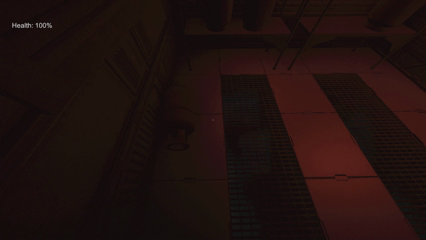
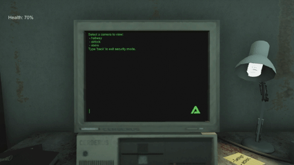
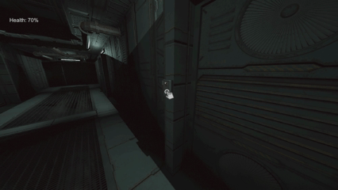
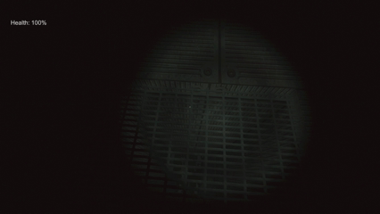
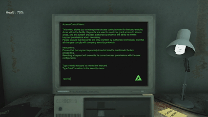
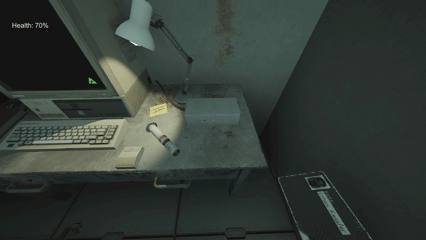
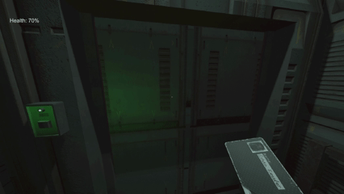

# Unity-Factory

### WIP (WORK IN PROGRESS)

## Game Overview:
This project is a Unity-based experimental horror game blending industrial and cosmic themes. The focus is on mechanics, atmosphere, and environmental storytelling rather than traditional combat. 

### Purpose of the Project:
I’ve always been fascinated by game development, and this project was my way of finally turning that interest into something tangible. I wanted to experience the full process of creating a game from scratch - design, mechanics, and atmosphere. The project ended up teaching me far more than I expected, both technically and creatively, and gave me a deep appreciation for the complexity of game design and Unity development.

### Key Features:
- First-person interaction system - built with C# interfaces (IInteractable) for modular and reusable object logic. 
- Cinematic camera control - implemented using Cinemachine for smooth transitions between player and scripted sequences. 
- Physics-based interactions - includes custom mechanics such as a bone sawing system and other environment-linked tools. 
- Player control lock & state handling - dynamic toggling of movement and camera input during scripted events. 
- Lighting & post-processing - Unity’s Built-in Render Pipeline, with fog, color grading, and layered lighting for an industrial atmosphere. 
- Trigger-driven animation system - interaction zones activate context-specific animations and sound effects.
- Full dialogue system - Done using Ink (Inkle's Narrative Scripting Language)

### Technologies Used:
- Engine: Unity (C#) 
- Camera: Cinemachine Animation: 
- Animator Controller & Timeline 
- Audio: Unity Audio Mixer & 3D spatial effects 
- Version Control: Git + GitHub 
- Platform Target: PC
  

  

  

  

  

  

  

  

